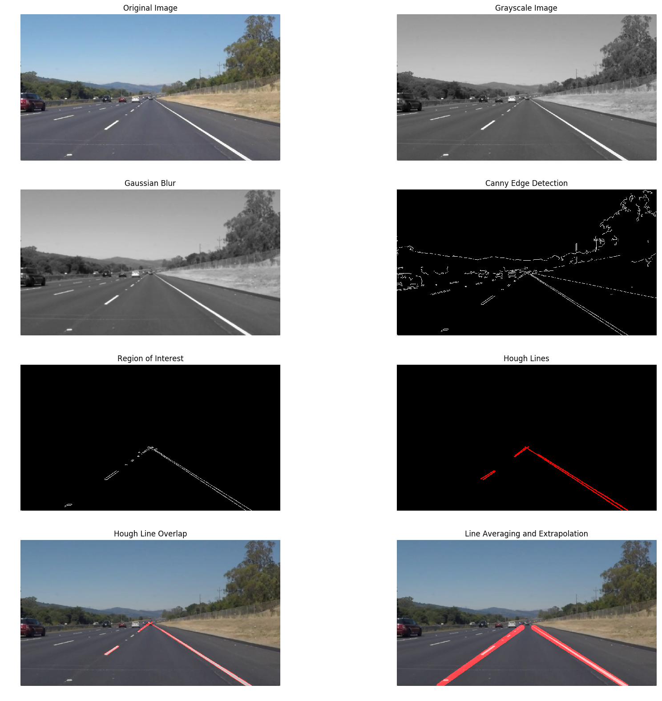

# **Finding Lane Lines on the Road**

## Result Videos

[Solid White Line Video](https://youtu.be/DsjgH_tvcJU)

[Solid Yellow Line Video](https://youtu.be/_yDiv--SJp8)

[Challenge Video](https://youtu.be/WNg6BOAJoZ8)

## Methodology
The goal of this project was to use a basic computer vision approach to identifying lane lines on a video stream recorded from a front-facing camera mounted on a vehicle.  The aproach that I took for this project was as follows:

1. Convert the video frame to graycale.
2. Apply a Gaussian Filter to blur the image and remove some noise.
3. Perform Canny edge detection to identify all edges
4. Apply an image mask to filter out everything besides the lane lines immediately to the right and left of the vehicle.
5. Perfom a Hough transform to get the hough lines in te form of (slope, intercept).
6. Filter out any lines that we know are not lane lines (ie. have a slope that is very high or very low corresponging to near vertical and near horizontal lines, respectively).
7. Separate the left and right lane lines (neative slope represents the left lane line and positive slope represents the right lane line)
8. Calculate a line for each the right and the left lane markings in the form of (slope, intercept) - I did this by calculating a weighted average of all left lines and then all right lines.  They were weighted according to their - the loger the line, the more it contributes to the average.
9. Extrapolate the lines from the bottom of the image to nearly the middle of the image on the y-axis.
10. Draw the average/extrapolated lines over the original image with a 60% opacity.

## Shortcomings
Though my algorithm works well on the first two videos, the challenge video revealed some issues. First, the algorithm is not very robust to changes in pavement color. Light pavement causes the algorithm to lose track of the lane lines because the edge detection thresholds are a little high – however lowering the thresholds adds a lot of lines that are not lane markings. I tried to filter a lot of these out by setting upper and lower thresholds on the slope of accepted lines. This succeeded in filtering out a lot of the “noisy” lines that were nearly vertical or horizontal. Also, camera placement was an issue in the challenge video. I needed to change the region of interest to cut out the front of the vehicle. Finally, I used a simple method to fit a linear lane detection line. This only matches the lane markings up to a certain point and does not follow the curve correctly. Also, vehicles dive in all different conditions, water or snow on the road would definitely adversely affect this algorithm. Finally, none of the videos contained another vehicle a short distance ahead of the data collection vehicle, so this may obscure the lane lines and cause an issue.

## Possible Improvements
The challenge video revealed the issues with my pipeline and I tried to fix them to the best of my ability within a reasonable amount of time. The really tough one was the change in pavement color. Concrete as opposed to asphalt is very light and significantly lowers the color gradient between the line paint and the road surface – especially when the line is yellow. One way to fix this could be to apply a color mask. By this I mean that we could identify any white-ish or yellow-ish pixels (lane lines) and convert those pixels to pure white to increase contrast. As for objects obscuring the lane lines, we could potentially fit a line to follow the entire road surface to help us estimate the equation of the lanelines. Adverse weather conditions would require some experimentation as I do not know how reflections from a wet surface would be picked up by the camera. Finally, for curved roads we would have to fit a line with a polynomial equation instead of a first order linear equation.
